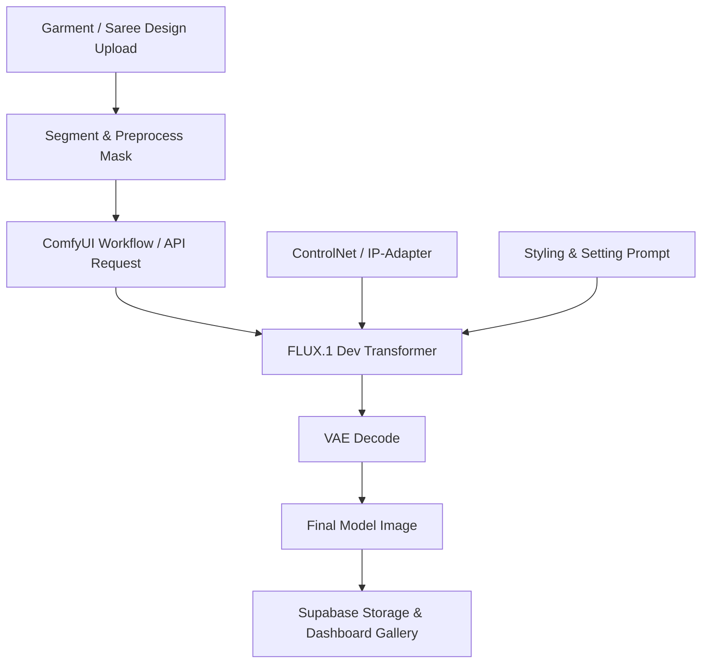

# FLUX.1 Dev Integration with ComfyUI

This directory serves as the hub for custom ComfyUI workflows, configurations, and documentation utilizing **FLUX.1 Dev** for advanced saree draping, fashion modeling, and high-fidelity product photography.

---

## 🌟 Model Overview: FLUX.1 Dev

**FLUX.1 Dev** is a state-of-the-art 12-billion parameter rectified flow transformer model developed by Black Forest Labs. It represents the pinnacle of open-weight image generation models, bridging the gap between local control and commercial-grade output.

### Why FLUX.1 Dev?
* **Unmatched Realism:** Significant improvement in human anatomy, skin textures, hair flow, and facial realism compared to older Stable Diffusion models (SD 1.5, SDXL).
* **Open Weights:** Licensed for non-commercial/developer use, permitting full customization, local execution, and fine-tuning.
* **Flexible Deployments:** Can be run locally on consumer GPUs (with quantization) or easily integrated via major developer-focused API endpoints.

---

## 🎯 Target Use Cases in SareeViz

| Use Case | Description | FLUX.1 Dev Advantage |
| :--- | :--- | :--- |
| **Realistic Humans** | Rendering lifelike faces, accurate hands/limbs, and natural body postures. | Solves the common "uncanny valley" and multi-finger issues present in SDXL. |
| **Fashion** | Creating editorial-style apparel presentations on diverse models. | Excellent cloth draping representation and fold physics. |
| **Product Photography** | E-commerce ready studio backgrounds, flat lays, and lighting setups. | Handles prompt-based lighting directions (e.g., "soft studio lighting, 8k resolution"). |
| **Saree Generation** | Traditional Indian ethnic wear draping, intricate border details, and fabric patterns. | Preserves fine embroidery patterns, zari details, and pleats structure. |
| **AI Influencers** | Maintaining aesthetic consistency and high-fidelity personas across shoots. | Higher text adherence and stylistic control for model styling. |

---

## 🚀 API Service Providers

For high-speed cloud generation without local hardware constraints, the following platforms support FLUX.1 Dev out of the box:

1. **fal.ai**
   * *Endpoint:* `fal-ai/flux/dev` or specialized ControlNet variants.
   * *Ideal for:* Low-latency inference, instant scaling, and structured JSON inputs.
2. **Together AI**
   * *Endpoint:* `together-ai/flux-1-dev`
   * *Ideal for:* Developer-friendly pricing, robust uptime, and simple integration.
3. **Hugging Face (Serverless / Inference Endpoints)**
   * *Endpoint:* Dedicated spaces or dedicated host endpoints.
   * *Ideal for:* Hosting custom LoRAs or running private quantized weights.

---

## ⚙️ Local ComfyUI Setup

To run FLUX.1 Dev locally in ComfyUI, follow these setup guidelines:

### 1. Hardware Requirements
* **Optimal:** Nvidia GPU with $\ge$ 16GB VRAM (for native FP16/BF16 inference).
* **Minimum:** Nvidia GPU with $\ge$ 8GB VRAM (requires quantized GGUF weights, e.g., `flux1-dev-Q4_K_S.gguf`).

### 2. Model & File Paths
Place the following files in their respective ComfyUI directories:

* **UNET / Transformer Model:**
  * Path: `ComfyUI/models/unet/` or `ComfyUI/models/diffusion_models/`
  * File: [flux1-dev.sft](https://huggingface.co/black-forest-labs/FLUX.1-dev/blob/main/flux1-dev.sft) (or quantized GGUF versions)
* **Text Encoders (CLIP & T5):**
  * Path: `ComfyUI/models/clip/`
  * Files: [t5xxl_fp16.safetensors](https://huggingface.co/comfyanonymous/flux_text_encoders/blob/main/t5xxl_fp16.safetensors) (or `t5xxl_fp8_e4m3fn.safetensors` for lower VRAM) and [clip_l.safetensors](https://huggingface.co/comfyanonymous/flux_text_encoders/blob/main/clip_l.safetensors)
* **VAE:**
  * Path: `ComfyUI/models/vae/`
  * File: [ae.safetensors](https://huggingface.co/black-forest-labs/FLUX.1-dev/blob/main/ae.safetensors)

### 3. Recommended Generation Parameters
* **Steps:** 20 to 30 steps (Rectified Flow sampler).
* **Sampler:** `euler` or `uni_pc` with `normal` scheduler.
* **Guidance Scale (Distillation):** 3.5 (FLUX requires lower guidance values than traditional Stable Diffusion models; values between 3.0 and 4.0 yield optimal realism).

---

## 🗺️ Pipeline Architecture

The following diagram illustrates how FLUX.1 Dev integrates into the SareeViz garment-to-model rendering workflow:

